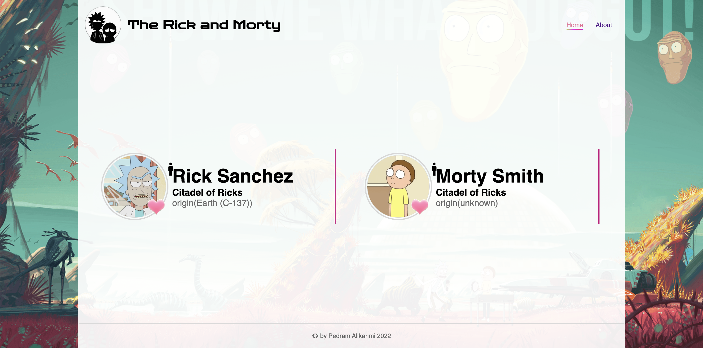

# Getting Started with Introduction to  Rick and Morty

# The npm package that needs to be installed
 <ul>
 <li> npm i styled-components</li>
 <li> npm i @reduxjs/toolkit</li>
  <li> npm i react-redux</li>
 <li> npm i react-router-dom</li>
 <li>npm i styled-components</li>
 </ul>

  